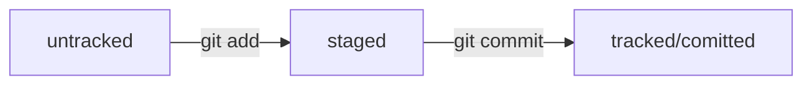

# Начни работу с Git

**Если хочешь разобраться сам - пройди бесплатный** [**курс от Я.Практикума по работе с Git**](https://practicum.yandex.ru/git-basics/ "Ссылка на курс")

## [Настройка окружения](https://practicum.yandex.ru/trainer/git-basics/lesson/2b82fb35-f581-4cd4-8806-c2a780e53347/ "Настройка окружения")

----

## [Шпаргалка по работе с командной строкой](https://practicum.yandex.ru/trainer/git-basics/lesson/fe0bcd71-f592-423b-bb81-27c37a6a115b "Работа с командной строкой")

----

## [Работа с локальным репозиторием](https://practicum.yandex.ru/trainer/git-basics/lesson/d05904f6-dc63-49cd-904b-3197a363f3c3/ "Работа с локальным репозиторием")

1. **создать** репозиторий  
```$ git init```
2. **удалить** репозиторий  
```$ rm -rf .git```
3. **посмотреть статус** репозитория  
```$ git status```
4. **_добавить_** файлы  
```
$ git add --all #добавить все файлы
$ git add <имя_файла.csv> #добавить конкретный файл имя_файла.csv
$ git add . #добавить всю текущую папку
```
5. выполнить **коммит**  
```$ git commit -m 'первый коммит'```
6. посмотреть **историю**  
```$ git log```

----

## [Работа с внешним репозиторием](https://practicum.yandex.ru/trainer/git-basics/lesson/19d174db-bd33-4307-a8e7-61b749a1639c/ "Работа с внешним репозиторием")

1. **Привязать** __удалённый__ репозиторий к локальному  
```$git remote add origin git@github.com:%ИМЯ_АККАУНТА%/first-project.git```
2. **Отправить** изменения в удалённый репозиторий  
```
git push -u origin main #в первый раз
git push #следующие разы
```

----

## Оформление коммита

1. для коммита только значимое сообщение
2. коммит должен быть атомарным
3. следует придерживаться стандарта Conventional Commits, подробнее по [ссылке.](https://www.conventionalcommits.org/ru/v1.0.0-beta.4/#%D1%81%D0%BF%D0%B5%D1%86%D0%B8%D1%84%D0%B8%D0%BA%D0%B0%D1%86%D0%B8%D1%8F "Conventional Commits")

----

## [Статусы файлов в Git](https://practicum.yandex.ru/trainer/git-basics/lesson/860e0bf4-ebd6-4e13-87fa-f76d92cfd11f/ "Статусы файлов в Git")



----

